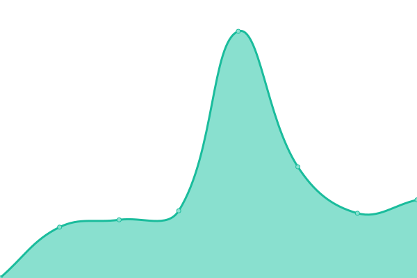

# [📈 Live Status](https://demo.upptime.js.org): <!--live status--> **🟩 All systems operational**

This repository contains the open-source uptime monitor and status page for [Upptime](https://upptime.js.org), powered by [Upptime](https://github.com/upptime/upptime).

With [Upptime](https://upptime.js.org), you can get your own unlimited and free uptime monitor and status page, powered entirely by a GitHub repository. We use [Issues](https://github.com/upptime/upptime/issues) as incident reports, [Actions](https://github.com/mauroxReyes/upptime-phoenix-webs/actions) as uptime monitors, and [Pages](https://demo.upptime.js.org) for the status page.

<!--start: status pages-->
<!-- This summary is generated by Upptime (https://github.com/upptime/upptime) -->
<!-- Do not edit this manually, your changes will be overwritten -->
<!-- prettier-ignore -->
| URL | Status | History | Response Time | Uptime |
| --- | ------ | ------- | ------------- | ------ |
|  [Google](https://www.google.com) | 🟩 Up | [google.yml](https://github.com/mauroxReyes/upptime-phoenix-webs/commits/HEAD/history/google.yml) | 

 81ms
     
 | 

<a href="https://demo.upptime.js.org/history/google">100.00%</a>
    

|  [Omnisa](https://omnisaservicios.com/) | 🟩 Up | [omnisa.yml](https://github.com/mauroxReyes/upptime-phoenix-webs/commits/HEAD/history/omnisa.yml) | 

 1812ms
     
 | 

<a href="https://demo.upptime.js.org/history/omnisa">98.04%</a>
    

|  [Artic](https://rticcoolers.net/) | 🟩 Up | [artic.yml](https://github.com/mauroxReyes/upptime-phoenix-webs/commits/HEAD/history/artic.yml) | 

 940ms
     
 | 

<a href="https://demo.upptime.js.org/history/artic">98.04%</a>
    

|  [Beverly](https://beverlyhillssa.com/) | 🟩 Up | [beverly.yml](https://github.com/mauroxReyes/upptime-phoenix-webs/commits/HEAD/history/beverly.yml) | 

 3075ms
     
 | 

<a href="https://demo.upptime.js.org/history/beverly">100.00%</a>
    

|  [DKP](https://dkplatam.com/) | 🟩 Up | [dkp.yml](https://github.com/mauroxReyes/upptime-phoenix-webs/commits/HEAD/history/dkp.yml) | 

 676ms
     
 | 

<a href="https://demo.upptime.js.org/history/dkp">98.05%</a>
    

<!--end: status pages-->

[**Visit our status website →**](https://demo.upptime.js.org)

## 📄 License

- Powered by: [Upptime](https://github.com/upptime/upptime)
- Code: [MIT](./LICENSE) © [Upptime](https://upptime.js.org)
- Data in the `./history` directory: [Open Database License](https://opendatacommons.org/licenses/odbl/1-0/)
